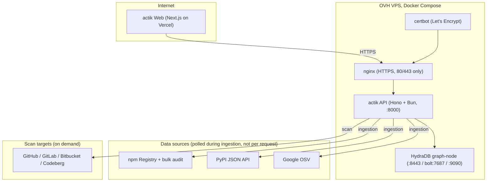
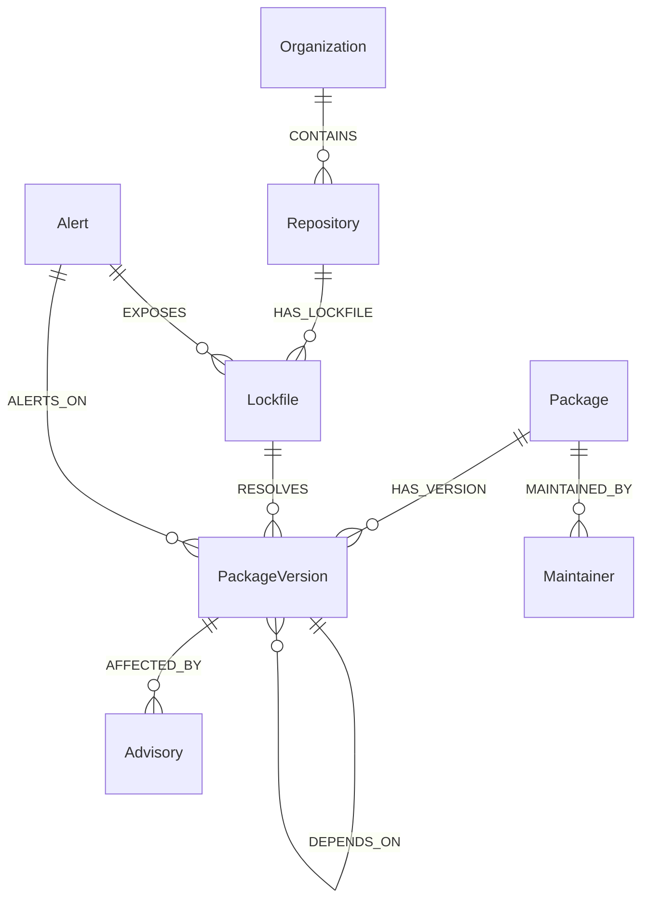
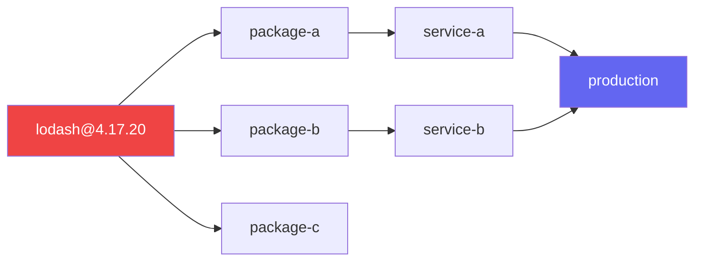
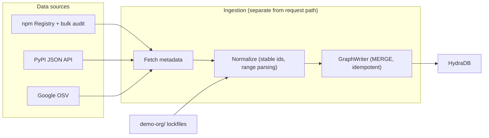

# actik API

> See the blast radius of a compromised dependency, powered by HydraDB.

actik is a graph-native software supply-chain intelligence platform. It models packages, versions, dependencies, vulnerabilities, maintainers and the internal applications that consume them as a single graph in HydraDB, then answers the questions that matter when a package is compromised:

- Which internal services are transitively exposed?
- Which version introduced the vulnerability? (and which version fixes it)
- Which applications resolved the bad version while it was live?
- Which other packages share a maintainer or infrastructure with it?
- Are there likely typosquat packages nearby?
- What is the complete blast radius?

Built for the [Hack Hydra](https://hackhydra.hydradb.com) Track 02A brief (Repos, Dependencies + Code as Graphs) around the [HydraDB open-source repo](https://github.com/hydra-db/hydradb).

## Highlights

- Hono + TypeScript backend running on Bun
- HydraDB `graph-node` alongside it in Docker Compose (`ghcr.io/hydra-db/hydradb`)
- Real graph traversals, blast radius is `algo.SSPaths` over `DEPENDS_ON` edges
- Repo scanning with exact, lockfile-grounded version resolution
- Time-travel exposure windows (the track's 09:00 compromised, 09:06 exposed scenario)
- Worm and propagation simulation plus a live OSV watch loop
- 140+ automated tests

## Architecture



Only nginx publishes ports (80/443). The API and HydraDB are reachable only on the internal compose network, so HydraDB stays private behind the API.

## Why HydraDB?

actik's whole pitch is graph-native supply-chain defense. The supply chain is relationship-heavy data, a package is meaningless in isolation. The important questions are all traversals:

```text
A depends on B
B depends on C
C is vulnerable
D depends on A
E shares a maintainer with B
```

Every feature in this repo leans on a single graph stored in HydraDB:

- Blast radius is `algo.SSPaths` over `DEPENDS_ON` edges, a traversal a relational DB answers with recursive CTEs and a vector DB cannot answer at all.
- The repo scanner writes `Repository - HAS_LOCKFILE - Lockfile - RESOLVES - PackageVersion` into the graph, then answers which resolved versions have advisories with a single `AFFECTED_BY` join.
- The exposure score re-traverses the same graph after each proposed fix to prove the fix clears the blast radius.
- Time travel answers which applications resolved the compromised version while it was live by reading `scanned_at` on `RESOLVES` edges and `published_at` / `modified_at` on advisories, a temporal predicate over graph edges no other store in this problem has the shape for.

Everything the API returns (paths, chains, exposure windows) is produced by traversing the graph, not by querying a table.

## Graph model



The critical relationship is `A DEPENDS_ON B`, version-to-version exact. Each dependency declaration resolves to a single target version, preferring the version a real lockfile resolved for the same source (lockfile-grounded) and falling back to the best range match. This keeps blast radius trustworthy, so `express@5.2.1` points at `qs@6.5.2`, not at every `qs` release.

Advisories carry both ends of the vulnerability story:

- `fixed_versions`, the first version that fixes the advisory.
- `introduced_versions`, the first version that was vulnerable.

Together they answer which version introduced it and which version fixes it for every affected package.

## Features

### Package and advisory exploration

- Package overview, versions, dependencies, dependents and maintainers
- Advisory details with affected versions, introduced and fixed versions
- Shared-maintainer analysis, packages connected through the same maintainer
- Typosquat candidates, similar package names with a risk score and the reasons (Levenshtein distance, character-substitution, scoped vs unscoped, popularity)

### Blast radius

The primary feature. Given `lodash@4.17.20`, actik runs a reverse `DEPENDS_ON` traversal inside HydraDB and returns:

- direct and transitive dependents
- maximum dependency depth
- every affected repository, with the exact resolved version, the requested range, the internal `node_modules` path, and the full dependency chain from the app down to the compromised package
- affected applications (repos whose lockfile kind is an application)
- traversal latency



### Repository scanner

`POST /api/scan` accepts a repository URL or `owner/name` and pulls `package-lock.json`, `yarn.lock`, `pnpm-lock.yaml`, `bun.lock`, `uv.lock` or `requirements*.txt` straight from the repo with no clone and no token across GitHub, GitLab, Bitbucket and Codeberg. It returns:

- an exposure score (0 to 100) weighted by severity times count
- every vulnerable package with its advisory and the exact fix command
- the exposure path from the app through the dependency chain
- a minimal-fix set, the fewest upgrades that clear every finding, each one verified by re-traversing HydraDB (the target version must exist in the graph and resolve to zero advisories)

Findings merge graph-backed `AFFECTED_BY` edges with a live Google OSV check, so a scan is useful on any lockfile, even packages never ingested. Unlinked packages are reported transparently.

### Time travel (exposure window)

`GET /api/advisories/:id/exposure-window` partitions the apps resolving an affected version into:

- `EXPOSED`, the app scan happened during the advisory live window.
- `AT_RISK`, the app still resolves an affected version but was scanned outside the window.
- `NOT_AFFECTED`, the app resolved the package but a version outside the affected range.

Pass `?asOf=YYYY-MM-DD` to replay the graph as it was at that date.

### Propagation simulation

`GET /api/simulate/propagation/lodash/4.17.20?compromisedAt=2026-05-14T09:00:00Z&perHopMs=360000` compromises a package at time zero and walks the reverse `DEPENDS_ON` closure, computing each app time-to-exposure as `exposedAt = compromisedAt + depth x perHopMs`, the track's 09:00 compromised, 09:06 exposed cadence by default.

### Live watch

`POST /api/watch/run` polls Google OSV for every version a scanned app resolves and records newly-flagged advisories as `Alert` nodes with a `first_seen_at`, linked to the affected version and every app that resolves it. `GET /api/watch/incidents` lists them newest-first with their exposure path.

## Getting started

### Local development (no Docker)

Requires [Bun](https://bun.sh).

```sh
bun install
bun run dev
```

Open http://localhost:8000/health

### Docker Compose (dev)

Pulls HydraDB's published image from `ghcr.io/hydra-db/hydradb`.

```sh
cp .env.example .env
docker compose -f compose.dev.yml up --build
```

| Service | URL |
|---|---|
| API | http://localhost:8000/health |
| HydraDB HTTP | http://localhost:8443 |
| HydraDB Bolt | `bolt://localhost:7687` |
| HydraDB readiness | http://localhost:9090/readyz |

HydraDB data (store, cache, auth token) persists in `./hydradb-data`; the compose entrypoint creates it on first start, so there is no manual setup.

### Docker Compose (prod)

```sh
cp .env.example .env
# set HYDRADB_AUTH_TOKEN to a real value (>= 32 chars)
# set FRONTEND_ORIGIN to the frontend's public origin (e.g. https://actik.xyz)
docker compose -f compose.prod.yml up -d --build
```

That single command is the whole deploy:

1. nginx starts with a throwaway self-signed cert (baked into its entrypoint) so it can serve the ACME challenge before Let's Encrypt has issued anything.
2. certbot runs right after and issues a real Let's Encrypt certificate for your API hostname (default `api.actik.xyz`, override with `CERTBOT_EMAIL`).
3. nginx detects the cert change and reloads itself, no manual step.

Only nginx publishes ports (80/443). The API and HydraDB are reachable only on the internal compose network, and nginx proxies `https://api.actik.xyz` to `http://api:8000`. HydraDB (8443/7687/9090) stays internal.

Nginx config lives in `proxy/nginx.conf` and the entrypoint in `compose.prod.yml`; change the API hostname in both if yours differs. Certs are valid 90 days and auto-renewed each `up` because certbot uses `--keep-until-expiring`.

Stop with `docker compose -f compose.prod.yml down`. Data lives in `./hydradb-data`; back it up or mount it from a persistent volume.

## Data ingestion

Seeds a supply-chain graph into HydraDB from three sources:

- npm registry plus npm bulk audit advisories
- PyPI JSON API vulnerabilities
- Google OSV (advisories, affected ranges, introduced and fixed versions)

After the package graph is written, the runner ingests a synthetic organization from `demo-org/` (see `DEMO_ORG_PATH`): each repository's lockfiles are parsed into `Repository - HAS_LOCKFILE - Lockfile - RESOLVES - PackageVersion` edges, keeping the exact resolved version, the requested range, and the internal `node_modules` path as evidence.



The API auto-seeds on startup: if HydraDB has an empty package graph it runs the full ingestion pipeline before serving (fast restarts skip it when already seeded). No manual step is needed, but you can refresh manually:

```sh
docker compose exec api bun run ingest
```

All limits come from env vars in `.env.example` (`INGESTION_MAX_PACKAGES`, `INGESTION_MAX_DEPTH`, `INGESTION_MAX_ADVISORIES`, `INGESTION_CONCURRENCY`). Re-running is idempotent (stable vertex ids + MERGE).

## API

Mounts at `/api`. Error responses use `{"error":{"code","message"}}`; 404 for unknown packages or advisories, 400 for invalid names, 429 when rate-limited.

All `:name` / `:name/:version` routes accept an optional `?ecosystem=npm|PyPI` query parameter to disambiguate packages that share a name across ecosystems.

| Route | Purpose |
|---|---|
| `GET /api/packages/:name` | Package overview + version list |
| `GET /api/packages/:name/maintainers` | Maintainers of a package |
| `GET /api/packages/:name/shared-maintainers` | Packages sharing a maintainer |
| `GET /api/packages/:name/typosquats` | Similar-name candidates (npm search + Levenshtein) |
| `GET /api/packages/:name/:version` | Version details + its advisories |
| `GET /api/packages/:name/:version/dependencies` | Forward dependencies |
| `GET /api/packages/:name/:version/dependents` | Direct dependents |
| `GET /api/packages/:name/:version/blast-radius` | Direct/transitive dependents, max depth, paths, per-repository exposure paths, latency, affected repositories + resolution evidence |
| `GET /api/packages/:name/:version/graph` | Dependency neighborhood for the frontend graph view, incl. resolving repositories |
| `GET /api/advisories/:id` | Advisory details + affected versions + known introduced and fixed versions |
| `GET /api/advisories/:id/exposure-window` | Apps that resolved an affected version while the advisory was live with a per-app `EXPOSED` / `AT_RISK` conclusion; optional `?asOf=YYYY-MM-DD` snapshot |
| `GET /api/graph/:name/:version` | Alias for the package graph endpoint |
| `POST /api/scan` | Scan a repository (`{"repo":"owner/name"}` or a full GitHub/GitLab/Bitbucket/Codeberg URL): fetch manifests, resolve exact versions, write into the graph, return exposure score + findings + fixes + minimal-fix set |
| `GET /api/scan/:owner/:name` | Re-run analysis for a previously scanned repo from the graph (no re-fetch) |
| `GET /api/simulate/propagation/:name/:version` | Worm simulation: compromise a package at `?compromisedAt=`, compute each app time-to-exposure from DEPENDS_ON depth (`?perHopMs=`, default 6 min) |
| `GET /api/investigate/:ecosystem/:name/:version` | One-call investigation: version details + advisories + blast radius + maintainer risk + typosquats + recommendations |
| `POST /api/watch/run` | Live-watch pass: poll OSV for every scanned/resolved version, record newly-flagged advisories as Alert nodes |
| `GET /api/watch/status` | Last live-watch run summary |
| `GET /api/watch/incidents` | Recent incidents, each with its exposure path (`repo -> lockfile -> pkg@version -> advisory`) |

Example, blast radius:

```http
GET /api/packages/lodash/4.17.20/blast-radius
```

```json
{
  "package": { "name": "lodash", "version": "4.17.20" },
  "directDependents": 0,
  "transitiveDependents": 0,
  "maxDepth": 0,
  "affectedRepositories": ["payments-api", "storefront"],
  "affectedApplications": 2,
  "repositoryPaths": [
    {
      "repository": "payments-api",
      "lockfile": "payments-api/package-lock.json",
      "internalPath": "node_modules/lodash",
      "path": ["4.17.20"],
      "depth": 0
    }
  ],
  "latencyMs": 3
}
```

Example, advisory with introduced and fixed versions:

```http
GET /api/advisories/GHSA-g4mx-q9vg-27p4
```

```json
{
  "id": "GHSA-g4mx-q9vg-27p4",
  "severity": "MODERATE",
  "summary": "urllib3's request body not stripped after redirect from 303 status changes request method to GET",
  "publishedAt": "2023-10-17T20:15:25Z",
  "modifiedAt": "2026-02-04T03:30:16.767903Z",
  "fixedVersions": { "urllib3": "1.26.18" },
  "introducedVersions": { "urllib3": "1.20" },
  "affectedVersions": [{ "name": "urllib3", "version": "1.26.4", "ecosystem": "PyPI" }]
}
```

## Project structure

```text
actik-backend/
├── src/
│   ├── index.ts              # app wiring, CORS, rate limiting, error handling
│   ├── routes/               # HTTP routes (packages, advisories, scan, watch)
│   ├── services/             # business logic (blast radius, advisory, investigate)
│   ├── hydra/                # HydraDB client, Cypher queries, schema
│   ├── ingestion/            # npm/PyPI/OSV ingestion, normalization, graph writer
│   ├── analysis/             # blast radius, paths, maintainers, typosquats, propagation
│   └── lib/                  # config, errors, logging, rate limiting, VCS clients
├── demo-org/                 # synthetic org (repos + lockfiles) for the demo dataset
├── proxy/                    # nginx config for production HTTPS
├── tests/                    # 140+ unit tests
├── compose.dev.yml           # dev docker compose (API + HydraDB)
├── compose.prod.yml          # prod docker compose (nginx + certbot + API + HydraDB)
├── .env.example              # all configuration knobs
└── README.md
```

## Tests

```sh
bun test
bunx tsc --noEmit
```

## Environment variables

All configuration lives in `.env.example`. Secrets stay in `.env` and are never committed. Key variables:

| Variable | Purpose |
|---|---|
| `FRONTEND_ORIGIN` | Allowed CORS origin (the frontend's public URL) |
| `HYDRADB_AUTH_TOKEN` | HydraDB auth token (>= 32 chars, required in prod) |
| `HYDRADB_HTTP_URL` | HydraDB HTTP endpoint (compose default `http://hydradb:8443`) |
| `NPM_REGISTRY_URL` / `PYPI_JSON_URL` / `OSV_API_URL` | Data source endpoints |
| `INGESTION_MAX_PACKAGES` / `INGESTION_MAX_DEPTH` / `INGESTION_MAX_ADVISORIES` | Ingestion limits |
| `INGESTION_CONCURRENCY` | Ingestion parallelism |
| `DEMO_ORG_PATH` | Path to the synthetic organization dataset |

## License

Open source under the [MIT License](LICENSE).

Built with HydraDB for Hack Hydra 2026, Track 02A, Repos, Dependencies + Code as Graphs.